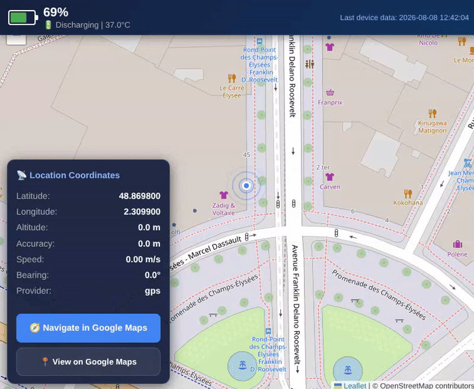

# Termux Location Tracker

Track your Android device's location & battery status live on a map.

A lightweight **FastAPI** server + **Termux** script that sends your Android device's GPS location and battery status to a live **Leaflet** map — for tracking any device running Termux.


---

## Server Setup

### 1. Install dependencies

```bash
python3 -m venv venv
source venv/bin/activate
pip install -r requirements.txt
```

### 2. Run the server

```bash
python main.py
```

The server runs on `http://0.0.0.0:9000`.

> ⚠️ **Note:** For real-world use, run the server on a machine with a public IP or use a tunnel like [ngrok](https://ngrok.com) / [Cloudflare Tunnel](https://developers.cloudflare.com/cloudflare-one/connections/connect-networks/).

---

## Android Device Setup (Termux)

### 1. Install Termux and prerequisites

> ⚠️ **Important:** `termux-api` is a **separate app** that must be installed alongside Termux.

1. Install **Termux** from [F-Droid](https://f-droid.org/en/packages/com.termux/) (recommended) or Google Play
2. Install **Termux:API** app from [F-Droid](https://f-droid.org/en/packages/com.termux.api/) (required for GPS & battery access)
3. Open Termux and install the API package + tools:

```bash
pkg install termux-api jq curl
```

### 2. Run the location script

```bash
bash termux-script/send_location.sh http://YOUR_SERVER_IP:9000 5
```

**Arguments:**
| Argument | Description |
|----------|-------------|
| `1` | Server URL |
| `2` | Send interval (seconds) |

---

## API Endpoints

| Method | Path | Description |
|--------|------|-------------|
| `POST` | `/location` | Receive location & battery JSON from device |
| `GET` | `/api/location` | Latest stored data (JSON) |
| `GET` | `/` or `/map` | Live map page |

### Test with sample data

```bash
curl -X POST http://localhost:9000/location \
  -H "Content-Type: application/json" \
  -d @example_data.json
```

---

## Features

- **Live map** with GPS accuracy circle and movement trail (last 100 points)
- **Battery status** — percentage, charging state, and temperature
- **Last device data time** — shows when the device actually sent data
- **Coordinates card** — latitude, longitude, altitude, speed, bearing
- **Fully responsive** — works on desktop, tablet, and mobile
- **Google Maps navigation & view** links with exact coordinates

---

## Demo



